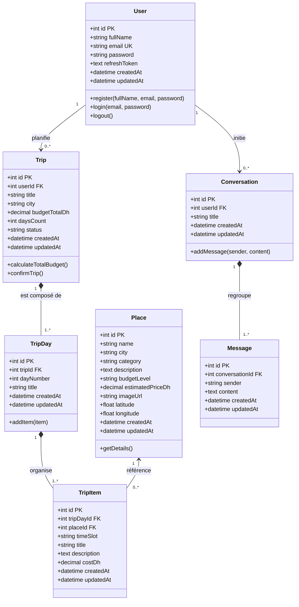

# Diagramme de Classes UML (Mermaid) 🇲🇦

```mermaid
classDiagram
    direction TB

    class User {
        +int id PK
        +string fullName
        +string email UK
        +string password
        +text refreshToken
        +datetime createdAt
        +datetime updatedAt
        +register(fullName, email, password)
        +login(email, password)
        +logout()
    }

    class Trip {
        +int id PK
        +int userId FK
        +string title
        +string city
        +decimal budgetTotalDh
        +int daysCount
        +string status
        +datetime createdAt
        +datetime updatedAt
        +calculateTotalBudget()
        +confirmTrip()
    }

    class TripDay {
        +int id PK
        +int tripId FK
        +int dayNumber
        +string title
        +datetime createdAt
        +datetime updatedAt
        +addItem(item)
    }

    class TripItem {
        +int id PK
        +int tripDayId FK
        +int placeId FK
        +string timeSlot
        +string title
        +text description
        +decimal costDh
        +datetime createdAt
        +datetime updatedAt
    }

    class Place {
        +int id PK
        +string name
        +string city
        +string category
        +text description
        +string budgetLevel
        +decimal estimatedPriceDh
        +string imageUrl
        +float latitude
        +float longitude
        +datetime createdAt
        +datetime updatedAt
        +getDetails()
    }

    class Conversation {
        +int id PK
        +int userId FK
        +string title
        +datetime createdAt
        +datetime updatedAt
        +addMessage(sender, content)
    }

    class Message {
        +int id PK
        +int conversationId FK
        +string sender
        +text content
        +datetime createdAt
        +datetime updatedAt
    }

    %% Relations et Cardinalités
    User "1" --> "0..*" Trip : planifie
    Trip "1" *-- "1..*" TripDay : est composé de
    TripDay "1" *-- "1..*" TripItem : organise
    Place "1" <-- "0..*" TripItem : référence

    User "1" --> "0..*" Conversation : initie
    Conversation "1" *-- "1..*" Message : regroupe
```
